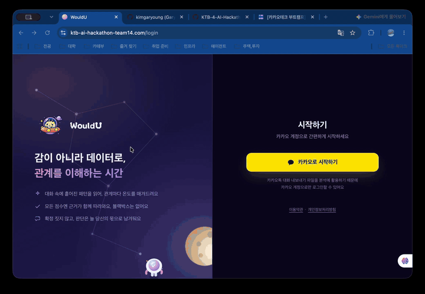
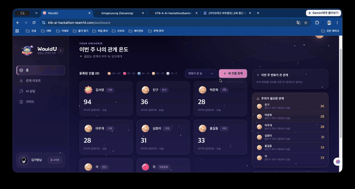
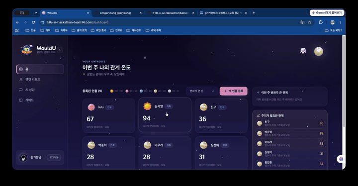
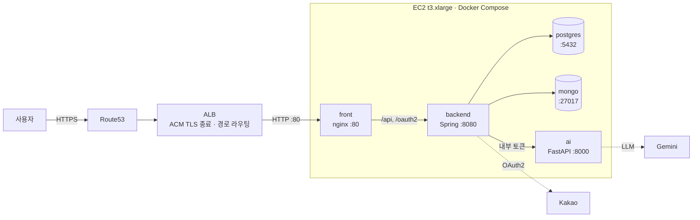
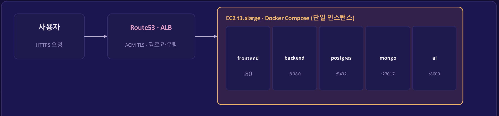

<p align="center">
  
</p>

<h1 align="center">WouldU — 끝없는 관계의 우주 속, 당신에게</h1>
<p align="center"><b>감이 아니라 데이터로, 관계를 이해하는 시간</b></p>
<p align="center">2026 KTB AI 해커톤 · TEAM 14 &nbsp;|&nbsp; https://ktb-ai-hackathon-team14.com</p>

---

## 프로젝트 소개

- 카카오톡 대화 내보내기 파일을 분석해 관계를 **PRQC 6요소(만족감·헌신·친밀감·신뢰·열정·애정)** 로 점수화하고, 점수 구간별 **행성 아이콘과 관계 온도**로 한눈에 보여주는 관계 분석 서비스입니다.
- 점수마다 근거가 된 **실제 대화 패턴을 함께 제시(Explainable AI)** 하고, 확정 진단이 아니라 **관찰된 사실**로만 표현하며, 8주간의 변화 추이를 추적합니다.
- 위험 신호가 감지된 관계는 **AI 상담 챗봇**으로 이어지고, 판단은 항상 사용자에게 위임하며 자해·자살 표현은 별도 위기대응(자살예방상담전화 1393)으로 분리 처리합니다.

| 항목 | 내용 |
|---|---|
| 기간 | 2026.08.18 ~ 08.21 (4일) — 카카오테크 부트캠프 4기 AI 해커톤 |
| 팀 구성 | AI 2명 · 풀스택 2명 · 클라우드 2명 (6명) |
| 결과 | 예선 통과 → **본선 8팀 선정 진출** |
| 타겟 | 연인·친구·가족·직장동료와의 관계에 고민이 있거나, 관계 유지에 피로감을 느끼는 사람 |

### 팀원

| 이름 | 역할 |
|---|---|
| Whale.lim | AI |
| Ella.byun | AI |
| woo.lee | 풀스택 |
| russell.kang | 풀스택 |
| lulu.roh | 클라우드 |
| **scarlett.kim** | **클라우드** — 카카오 소셜 로그인 · 인프라/배포 · DB 마이그레이션 *(이 README 작성자)* |

## 동작 영상

**1. 로그인 → 대시보드** ([mp4](docs/demo/01-intro-login.mp4))



**2. 인물 등록 → 관계 리포트 → AI 상담** ([mp4](docs/demo/02-report-chat.mp4))



**3. 사용 가이드** ([mp4](docs/demo/03-guide.mp4))



## 핵심 기능

- 로그인 : 카카오 원터치 로그인
- 대시보드 : 점수 구간별 행성 아이콘, 변화가 큰 관계 TOP 3, 주의가 필요한 관계 사유 표시
- 인물 등록 : 관계 정보 → 대화 파일 업로드 → 체크인 3단계 마법사 (관계 유형이 PRQC 가중치에 반영)
- 관계 리포트 : 종합 온도 게이지, PRQC 6요소 레이더/막대 차트, 근거 카드(실제 대화 인용), 8주 변화 그래프
- AI 상담 챗봇 : 인물별 상담 스레드, 확정 진단 대신 관찰된 사실만 진술, 위험 신호 시 상담센터 연결
- 사용 가이드 : 이용 순서 5단계, 카카오톡 내보내기 방법, 상황별 데모 재생

## 기술 스택 & 아키텍처

- Frontend : React (Vite SPA)
- Backend : Spring Boot · PostgreSQL + MongoDB · Flyway
- AI : FastAPI · Gemini 3.5 Flash-Lite · Few-shot
- Infra : AWS EC2 · ALB · ACM · Route53 · Docker Compose (단일 인스턴스)



- 외부로 열리는 포트는 front(nginx)의 80뿐. DB·백엔드·AI는 컨테이너 네트워크 안에만 존재합니다.
- TLS는 **ALB에서 ACM 인증서로 종료**하고 EC2는 평문 80만 받습니다. EC2 안에 인증서를 두지 않습니다.
- 분석 요청은 `POST /relationships/{id}/analyses` → 202 즉시 응답 → 백엔드 Worker가 카카오톡 원본을 정규화(NDJSON, gzip)해 AI 서버를 동기 호출 → 프론트는 `GET /analysis-jobs/{jobId}` 폴링.

```
KTB-AI-hacker-toon/
├── compose.yaml        로컬 전체 실행 스택 (PostgreSQL · MongoDB · backend · ai · front)
├── compose.prod.yaml   EC2 배포 오버레이 (포트 닫기 · nginx 정적 빌드 · 메모리 제한)
├── .env.example        로컬 환경변수 템플릿  /  .env.prod.example  배포용
├── backend/            Spring Boot API + Flyway 마이그레이션
├── ai/                 FastAPI 분석 서버
├── front/              React + Vite
├── docs/demo/          동작 영상 (gif · mp4)
└── DEPLOYMENT.md       AWS 배포 가이드
```

## 프로젝트 기여 (scarlett.kim · 클라우드)

### 1. 카카오 소셜 로그인 구현

docker compose로 Spring · MongoDB · PostgreSQL을 세팅하고, 카카오 개발자 계정에서 키를 발급받아 로그인까지 구현한 뒤 팀에 환경을 넘겼습니다.

```
카카오 로그인 클릭 → 백엔드 GET → (부팅 때 장착해둔) CLIENT_ID를 URL에 붙여 카카오로 리다이렉트
→ 사용자 동의 → 인가 코드가 콜백(/api/v1/auth/kakao/callback)으로 옴
→ 백엔드가 코드 + CLIENT_SECRET으로 카카오에 토큰 교환 요청(서버 간, TLS) → 액세스 토큰 수령
→ 토큰으로 카카오 API에서 사용자 정보(id, 닉네임) 조회 → PostgreSQL upsert → 세션 쿠키 발급 → 홈
```

- 콜백 경로는 `application.yml`(`redirect-uri`)과 `SecurityConfig.java`(`redirectionEndpoint`) 두 곳에 고정되어 있습니다.
- redirect_uri의 호스트는 요청의 Host 헤더로 만들어지므로, 프론트(5173)가 `/api`·`/oauth2`를 백엔드로 프록시해 **세션 쿠키와 redirect_uri를 한 오리진으로 유지**합니다.

### 2. 클라우드 세팅 · 배포

배포 조건이 아래와 같았기 때문에 **EC2 1대 + ALB(ACM) + Route53** 구성을 선택했습니다.

1. 한 대의 EC2에서 여러 컨테이너가 도는 방식으로 배포 (비용·시간 제약)
2. Route53의 도메인이 ALB와 연결되어 있음
3. 카카오 소셜 로그인을 위해 **HTTPS가 반드시 동작**해야 함
4. HTTPS를 위해 ACM이 필요하고, ACM 인증서를 붙이기 위해 ALB 도입
5. `backend_team` / `AI_Team` 두 저장소로 나뉘어 있던 것을 하나의 모노레포로 합치고 `docker compose up` 한 번에 5개 서비스가 뜨도록 정리



### 3. DB 스키마 변경 후 마이그레이션 — Flyway

해커톤 중 스키마가 계속 바뀌어서(V1 → V9) 팀원 각자의 DB와 운영 DB를 같은 상태로 맞출 방법이 필요했습니다.

핵심은 DB 안의 `flyway_schema_history` 장부 테이블입니다.

1. backend(Spring)가 기동하면 Flyway가 먼저 실행됩니다
2. jar 안에 든 마이그레이션 파일 목록(`backend/src/main/resources/db/migration/V*.sql`)과 장부를 대조합니다
3. **장부에 없는 버전만** 번호 순서대로 실행하고, 실행할 때마다 장부에 기록합니다

→ 누가 어떤 상태의 DB를 갖고 있든 `docker compose up`만 하면 최신 스키마로 수렴합니다.

## 트러블슈팅

| 증상 | 원인 | 해결 |
|---|---|---|
| 컨테이너는 다 떠 있는데 브라우저에 `DNS_PROBE_FINISHED_NXDOMAIN` | DNS 레코드를 못 찾고 있었음. `dig 도메인`으로 DNS→IP / 네트워크 / TLS / 실제 응답 순으로 범위를 좁힘. AWS 콘솔 세션이 만료되어 레코드 변경이 반영되지 않은 상태 | Route53 레코드를 다시 확인해 ALB에 연결. 확인 시 시크릿 모드로 캐시 영향을 배제 |
| 카카오 로그인 후 `{"error":{"code":"INVALID_REQUEST","message":"요청 형식이 올바르지 않습니다."}}` | 백엔드가 거절. `.env`의 카카오 관련 값을 확인하니 카카오 콘솔의 Redirect URI는 `http`, 서비스는 `https`로 스킴이 달랐음 | 콘솔 Redirect URI를 `https://ktb-ai-hackathon-team14.com/api/v1/auth/kakao/callback`으로 변경 |
| `503 Service Temporarily Unavailable` | ALB 리스너가 장시간 **unused** 상태. 새로 만든 대상 그룹이 ALB 리스너에 연결되지 않아 리스너가 기존 대상 그룹을 바라보고 있었음 | 리스너 규칙의 전달 대상을 새 대상 그룹으로 교체 |
| `KOE006` | Redirect URI가 콘솔 등록값과 불일치. 경로에 `/api/v1`이 빠졌거나 포트(5173/8080)가 다름 | 콘솔에 5173·8080·배포 도메인 세 개를 모두 등록 |
| `KOE101` / `KOE004` | JavaScript 키를 넣었거나(REST API 키여야 함) / 콘솔에서 카카오 로그인이 비활성 | 키 교체 / 카카오 로그인 ON |
| 프론트가 API를 못 부름 | 8080으로 직접 접속해 프록시를 타지 않음 | 반드시 **5173**으로 접속 |
| `port is already allocated` | 5173·8080·5432·27017을 다른 프로세스가 점유 | `lsof -nP -iTCP:5173 -sTCP:LISTEN`으로 확인 후 정리 |
| `Cannot find a Java installation ... 21` | 호스트에서 직접 실행 시 JDK 21 없음 | `brew install openjdk@21` 후 `~/Library/Java/JavaVirtualMachines`에 심링크 |

## 빠른 시작

**필요한 것: Docker Desktop 하나면 됩니다.** (Java·Python·Node는 전부 컨테이너 안에 들어 있습니다)

```bash
git clone https://github.com/kimgaryoung/KTB-AI-hacker-toon.git
cd KTB-AI-hacker-toon

cp .env.example .env          # 그대로 두면 카카오 로그인 + AI stub 으로 동작
docker compose up -d --build  # DB + 백엔드 + AI + 프론트 전부 기동 (첫 빌드 수 분)
docker compose ps             # 5개 서비스가 healthy/running 이면 준비 완료
```

그 다음 http://localhost:5173 으로 접속합니다. **로그인은 반드시 5173으로 들어가세요.**

| 주소 | 내용 |
|---|---|
| http://localhost:5173 | 프론트엔드 |
| http://localhost:8080/actuator/health | 백엔드 헬스체크 |
| http://localhost:5173/api/v1/auth/kakao/authorize | 카카오 로그인 진입 |

실제 AI 분석을 켜려면 `.env`에서 `AI_MODE=http`, `GOOGLE_API_KEY=<Gemini 키>`로 바꾸고 `docker compose up -d backend ai`.

| 서비스 | 포트 | 용도 |
|---|---|---|
| front | 5173 | Vite 개발 서버 (`/api`·`/oauth2`는 backend로 프록시, 소스 bind mount → HMR) |
| backend | 8080 | Spring Boot API. 코드 수정 시 `docker compose up -d --build backend` |
| ai | (내부 8000) | FastAPI 분석 서버. backend만 `http://ai:8000`으로 호출 |
| postgres | 5432 | 애플리케이션 DB (Flyway가 스키마 생성) |
| mongo | 27017 | 상담 메시지 저장 |

```bash
docker compose down           # 정지 (데이터 유지)
docker compose down -v        # 데이터까지 삭제
```

### 환경변수

`.env`는 커밋되지 않으며 compose가 읽어 컨테이너에 주입합니다. 값을 바꿨으면 재기동해야 반영됩니다.

| 변수 | 용도 |
|---|---|
| `KAKAO_CLIENT_ID` / `KAKAO_CLIENT_SECRET` | 카카오 **REST API 키**(JavaScript 키 아님) / Client Secret — 서버 전용 비밀값 |
| `FRONTEND_BASE_URL` | 로그인 성공 후 돌아갈 주소 (기본 `http://localhost:5173`) |
| `AI_MODE` | `stub`(더미 결과, 기본) 또는 `http`(ai 컨테이너 실제 호출) |
| `AI_SERVICE_TOKEN` | 백엔드 ↔ ai 내부 토큰. compose가 양쪽에 같은 값을 주입 |
| `GOOGLE_API_KEY` | Gemini API 키. `AI_MODE=http`일 때 필수 |
| `DB_URL` / `MONGODB_URI` / `AI_BASE_URL` | 컨테이너 실행 시 compose가 서비스 이름 기준으로 덮어씀. 호스트에서 직접 실행할 때만 사용 |

### 카카오 개발자 콘솔

| 위치 | 할 일 |
|---|---|
| 앱 설정 > 앱 키 | **REST API 키** 복사 |
| 앱 설정 > 플랫폼 > Web | `http://localhost:5173`, `http://localhost:8080`, `https://ktb-ai-hackathon-team14.com` 등록 |
| 제품 설정 > 카카오 로그인 | 활성화 ON, 동의항목: 닉네임·프로필 사진 |
| 제품 설정 > 카카오 로그인 > Redirect URI | `{오리진}/api/v1/auth/kakao/callback` — 5173 · 8080 · 배포 도메인 세 개 모두 등록 |

### 배포

```bash
cp .env.prod.example .env   # FRONTEND_BASE_URL=https://..., SESSION_COOKIE_SECURE=true, GOOGLE_API_KEY
docker compose -f compose.yaml -f compose.prod.yaml up -d --build
```

아키텍처 · AWS 리소스 설정값 · 배포 후 검증 체크리스트는 **[DEPLOYMENT.md](./DEPLOYMENT.md)** 를 참고하세요.

## 더 읽을 것

- [`backend/README.md`](./backend/README.md) — 백엔드 패키지 구조와 설계 원칙
- [`ai/README.md`](./ai/README.md) — AI 분석 서버 파이프라인 구조와 API
- [`backend/docs/AI_INTERNAL_API_SPEC.md`](./backend/docs/AI_INTERNAL_API_SPEC.md) — 백엔드 ↔ AI 내부 계약
- [`DEPLOYMENT.md`](./DEPLOYMENT.md) — EC2 1대 + ALB(ACM) + Route53 배포 가이드

## 회고

4일간의 해커톤 회고는 블로그에 정리했습니다 → **https://hansol2124.tistory.com/157**
