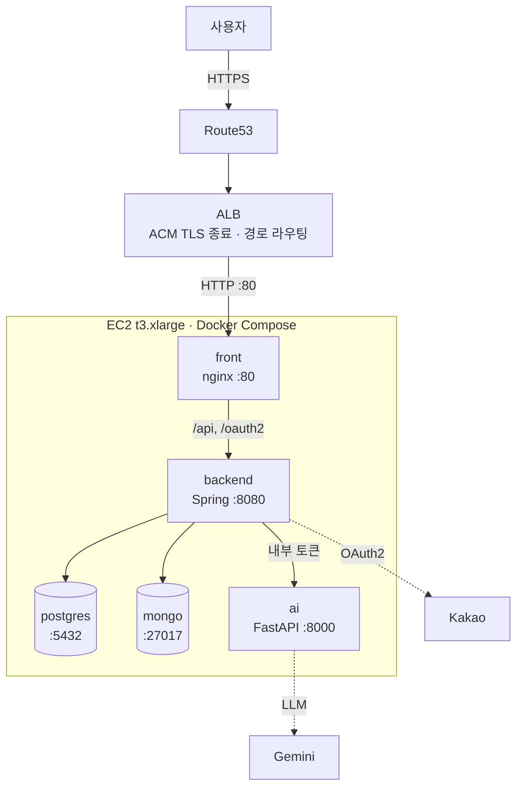
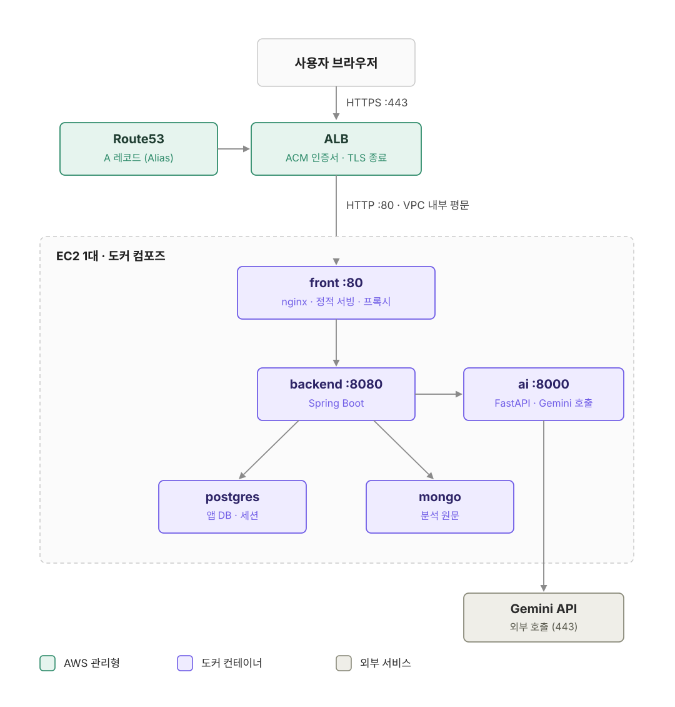

<p align="center">
  
</p>

<h1 align="center">WouldU — 끝없는 관계의 우주 속, 당신에게</h1>
<p align="center"><b>감이 아니라 데이터로, 관계를 이해하는 시간</b></p>
<p align="center">2026 KTB AI 해커톤 · TEAM 14 &nbsp;|&nbsp; https://ktb-ai-hackathon-team14.com</p>

---

## 프로젝트 소개

- 카카오톡 대화 내보내기 파일을 분석해 관계를 **PRQC 6요소(만족감·헌신·친밀감·신뢰·열정·애정)** 로 점수화하고, 점수 구간별 **행성 아이콘과 관계 온도**로 한눈에 보여주는 관계 분석 서비스입니다.
- 점수마다 근거가 된 **실제 대화 패턴을 함께 제시(Explainable AI)** 하고, 확정 진단이 아니라 **관찰된 사실**로만 표현하며, 8주간의 변화 추이를 추적합니다.
- 위험 신호가 감지된 관계는 **AI 상담 챗봇**으로 이어지고, 판단은 항상 사용자에게 위임하며 자해·자살 표현은 별도 위기대응(자살예방상담전화 1393)으로 분리 처리합니다.

| 항목 | 내용 |
|---|---|
| 기간 | 2026.08.18 ~ 08.21 (4일) — 카카오테크 부트캠프 4기 AI 해커톤 |
| 팀 구성 | AI 2명 · 풀스택 2명 · 클라우드 2명 (6명) |
| 결과 | 예선 통과 → **본선 8팀 선정 진출** |
| 타겟 | 연인·친구·가족·직장동료와의 관계에 고민이 있거나, 관계 유지에 피로감을 느끼는 사람 |


## 동작 영상

**1. 로그인 → 대시보드** 


**2. 인물 등록 → 관계 리포트 → AI 상담** 


**3. 사용 가이드**


## 핵심 기능

- 로그인 : 카카오 원터치 로그인
- 대시보드 : 점수 구간별 행성 아이콘, 변화가 큰 관계 TOP 3, 주의가 필요한 관계 사유 표시
- 인물 등록 : 관계 정보 → 대화 파일 업로드 → 체크인 3단계 마법사 (관계 유형이 PRQC 가중치에 반영)
- 관계 리포트 : 종합 온도 게이지, PRQC 6요소 레이더/막대 차트, 근거 카드(실제 대화 인용), 8주 변화 그래프
- AI 상담 챗봇 : 인물별 상담 스레드, 확정 진단 대신 관찰된 사실만 진술, 위험 신호 시 상담센터 연결
- 사용 가이드 : 이용 순서 5단계, 카카오톡 내보내기 방법, 상황별 데모 재생

## 기술 스택 & 아키텍처

- Frontend : React (Vite SPA)
- Backend : Spring Boot · PostgreSQL + MongoDB · Flyway
- AI : FastAPI · Gemini 3.5 Flash-Lite · Few-shot
- Infra : AWS EC2 · ALB · ACM · Route53 · Docker Compose (단일 인스턴스)




## 프로젝트 기여 (scarlett.kim · 클라우드)

### 1. 카카오 소셜 로그인 구현

docker compose로 Spring · MongoDB · PostgreSQL을 세팅하고, 카카오 개발자 계정에서 키를 발급받아 로그인까지 구현한 뒤 팀에 환경을 넘겼습니다.

```
카카오 로그인 클릭 → 백엔드 GET → (부팅 때 장착해둔) CLIENT_ID를 URL에 붙여 카카오로 리다이렉트
→ 사용자 동의 → 인가 코드가 콜백(/api/v1/auth/kakao/callback)으로 옴
→ 백엔드가 코드 + CLIENT_SECRET으로 카카오에 토큰 교환 요청(서버 간, TLS) → 액세스 토큰 수령
→ 토큰으로 카카오 API에서 사용자 정보(id, 닉네임) 조회 → PostgreSQL upsert → 세션 쿠키 발급 → 홈
```

- 콜백 경로는 `application.yml`(`redirect-uri`)과 `SecurityConfig.java`(`redirectionEndpoint`) 두 곳에 고정되어 있습니다.
- redirect_uri의 호스트는 요청의 Host 헤더로 만들어지므로, 프론트(5173)가 `/api`·`/oauth2`를 백엔드로 프록시해 **세션 쿠키와 redirect_uri를 한 오리진으로 유지**합니다.

### 2. 클라우드 세팅 · 배포

배포 조건이 아래와 같았기 때문에 **EC2 1대 + ALB(ACM) + Route53** 구성을 선택했습니다.

1. 한 대의 EC2에서 여러 컨테이너가 도는 방식으로 배포 (비용·시간 제약)
2. Route53의 도메인이 ALB와 연결되어 있음
3. 카카오 소셜 로그인을 위해 **HTTPS가 반드시 동작**해야 함
4. HTTPS를 위해 ACM이 필요하고, ACM 인증서를 붙이기 위해 ALB 도입
5. `backend_team` / `AI_Team` 두 저장소로 나뉘어 있던 것을 하나의 모노레포로 합치고 `docker compose up` 한 번에 5개 서비스가 뜨도록 정리

<p align="center"></p>

### 3. DB 스키마 변경 후 마이그레이션 — Flyway

해커톤 중 스키마가 계속 바뀌어서(V1 → V9) 팀원 각자의 로컬 DB, 운영 EC2의 DB를 같은 상태로 맞출 방법이 필요했습니다.
JPA의 `ddl-auto: update`로 엔티티에서 테이블을 자동 생성하는 대신 **Flyway로 스키마를 SQL 파일로 버전 관리**하고, Hibernate는 `validate`만 하도록 했습니다.

**왜 `ddl-auto`가 아니라 Flyway인가**

- `ddl-auto: update`는 컬럼 추가는 해주지만 컬럼 삭제·타입 변경·인덱스·시드 데이터는 처리하지 못하고, 누가 언제 무엇을 바꿨는지 기록이 남지 않습니다.
- Flyway는 변경 이력을 **번호가 붙은 SQL 파일**로 남기고, 어떤 DB든 적용된 버전을 추적하므로 모든 환경이 같은 순서로 같은 상태에 도달합니다.
- Spring Boot 공식 가이드도 Flyway 같은 마이그레이션 도구를 쓸 때는 `spring.jpa.hibernate.ddl-auto=validate`로 두고, 스키마 생성은 마이그레이션에 맡기도록 권장합니다.

**이 프로젝트의 설정**

```yaml
# backend/src/main/resources/application.yml
spring:
  jpa:
    hibernate:
      ddl-auto: validate   # Hibernate는 엔티티 ↔ 테이블 구조가 맞는지 검사만 한다
  flyway:
    enabled: true          # 기동 시 classpath:db/migration 의 V*.sql 을 자동 실행
```

```
backend/src/main/resources/db/migration/
├── V1__initial_schema.sql                                  테이블·인덱스 초기 생성
├── V4__add_dashboard_report_index.sql                      대시보드 조회 인덱스
├── V5__add_normalized_conversation_messages.sql            정규화 대화 메시지 테이블
├── V6__seed_verified_support_resources.sql                 검수된 상담 리소스 시드
├── V7__add_conversation_test_fixture_flag.sql              테스트 픽스처 플래그 컬럼
├── V8__add_self_report_comparison_to_relationship_reports.sql
└── V9__seed_relationship_counseling_resources.sql          관계 상담 리소스 시드
```

파일 이름 규칙은 `V<버전>__<설명>.sql` 입니다 — 접두사 `V`, 버전 번호, **언더스코어 두 개**, 설명. 버전은 숫자 순으로 정렬되어 실행되며, 중간에 비어 있는 번호(V2·V3)는 상관없습니다.

**동작 원리 — `flyway_schema_history` 장부 테이블**

Flyway는 대상 DB에 `flyway_schema_history` 테이블을 만들어 **어떤 마이그레이션을 언제, 누가 적용했는지와 파일의 체크섬**을 기록합니다.

1. backend(Spring)가 기동하면 JPA `EntityManagerFactory`가 만들어지기 **전에** Flyway가 먼저 실행됩니다
2. jar 안의 `db/migration/V*.sql` 목록과 장부를 대조합니다
3. **장부에 없는 버전만** 번호 순서대로 실행하고, 한 파일이 끝날 때마다 장부에 한 줄씩 기록합니다 (각 마이그레이션은 정확히 한 번만 적용)
4. 장부에 이미 있는 파일은 저장된 체크섬과 현재 파일의 체크섬을 비교해, 다르면 `Migration checksum mismatch` 로 기동을 **실패**시킵니다
5. Flyway가 끝난 뒤 Hibernate가 `validate`로 엔티티와 실제 테이블이 일치하는지 확인합니다

```sql
-- 현재 DB에 적용된 버전 확인
SELECT installed_rank, version, description, checksum, installed_on, success
  FROM flyway_schema_history ORDER BY installed_rank;
```

→ 누가 어떤 상태의 DB를 갖고 있든 `docker compose up`만 하면 최신 스키마로 수렴합니다. 새로 합류한 팀원은 V1부터 V9까지 전부, 이미 V7까지 적용된 운영 DB는 V8·V9만 실행됩니다.

**스키마를 바꿀 때 실제로 하는 일**

```sql
-- 예: V8__add_self_report_comparison_to_relationship_reports.sql
ALTER TABLE relationship_reports
    ADD COLUMN self_report_comparison VARCHAR(2000) NOT NULL DEFAULT '';
```

1. 가장 큰 버전 + 1 번호로 `V10__설명.sql` 파일을 추가한다 (기존 파일은 건드리지 않는다)
2. JPA 엔티티도 같은 구조로 수정한다 — 안 맞으면 `validate`가 기동을 막아준다
3. `docker compose up -d --build backend` → Flyway가 V10만 적용하고 장부에 기록한다
4. 기존 데이터가 있는 테이블에 `NOT NULL` 컬럼을 추가할 때는 `DEFAULT`를 꼭 붙인다 (V7·V8 참고)

**주의할 점**

- **이미 적용된 마이그레이션 파일은 절대 수정하지 않는다.** 체크섬이 달라져 모든 환경에서 기동이 실패합니다. 고칠 게 있으면 새 버전 파일로 되돌리거나 덮어씁니다. (로컬에서만 실수했다면 `docker compose down -v`로 DB를 지우고 다시 올리는 게 가장 빠릅니다)
- 한 번 배포된 버전보다 **작은 번호**의 파일을 나중에 추가하면 기본 설정에서는 무시되거나 validate 에러가 납니다 (`outOfOrder` 기본값 false). 번호는 항상 뒤에 붙입니다.
- 시드 데이터(V6·V9)도 마이그레이션으로 넣어서, 모든 환경에 같은 상담 리소스 목록이 들어가도록 했습니다.

참고: [Flyway — Versioned migrations](https://documentation.red-gate.com/fd/versioned-migrations-273973333.html) · [Spring Boot — Use a Higher-level Database Migration Tool](https://docs.spring.io/spring-boot/how-to/data-initialization.html)

## 트러블슈팅

| 증상 | 원인 | 해결 |
|---|---|---|
| 컨테이너는 다 떠 있는데 브라우저에 `DNS_PROBE_FINISHED_NXDOMAIN` | DNS 레코드를 못 찾고 있었음. `dig 도메인`으로 DNS→IP / 네트워크 / TLS / 실제 응답 순으로 범위를 좁힘. AWS 콘솔 세션이 만료되어 레코드 변경이 반영되지 않은 상태 | Route53 레코드를 다시 확인해 ALB에 연결. 확인 시 시크릿 모드로 캐시 영향을 배제 |
| 카카오 로그인 후 `{"error":{"code":"INVALID_REQUEST","message":"요청 형식이 올바르지 않습니다."}}` | 백엔드가 거절. `.env`의 카카오 관련 값을 확인하니 카카오 콘솔의 Redirect URI는 `http`, 서비스는 `https`로 스킴이 달랐음 | 콘솔 Redirect URI를 `https://ktb-ai-hackathon-team14.com/api/v1/auth/kakao/callback`으로 변경 |
| `503 Service Temporarily Unavailable` | ALB 리스너가 장시간 **unused** 상태. 새로 만든 대상 그룹이 ALB 리스너에 연결되지 않아 리스너가 기존 대상 그룹을 바라보고 있었음 | 리스너 규칙의 전달 대상을 새 대상 그룹으로 교체 |
| `KOE006` | Redirect URI가 콘솔 등록값과 불일치. 경로에 `/api/v1`이 빠졌거나 포트(5173/8080)가 다름 | 콘솔에 5173·8080·배포 도메인 세 개를 모두 등록 |
| `KOE101` / `KOE004` | JavaScript 키를 넣었거나(REST API 키여야 함) / 콘솔에서 카카오 로그인이 비활성 | 키 교체 / 카카오 로그인 ON |
| 프론트가 API를 못 부름 | 8080으로 직접 접속해 프록시를 타지 않음 | 반드시 **5173**으로 접속 |
| `port is already allocated` | 5173·8080·5432·27017을 다른 프로세스가 점유 | `lsof -nP -iTCP:5173 -sTCP:LISTEN`으로 확인 후 정리 |
| `Cannot find a Java installation ... 21` | 호스트에서 직접 실행 시 JDK 21 없음 | `brew install openjdk@21` 후 `~/Library/Java/JavaVirtualMachines`에 심링크 |

## 빠른 시작

**필요한 것: Docker Desktop 하나면 됩니다.** (Java·Python·Node는 전부 컨테이너 안에 들어 있습니다)

```bash
git clone https://github.com/kimgaryoung/KTB-AI-hacker-toon.git
cd KTB-AI-hacker-toon

cp .env.example .env          # 그대로 두면 카카오 로그인 + AI stub 으로 동작
docker compose up -d --build  # DB + 백엔드 + AI + 프론트 전부 기동 (첫 빌드 수 분)
docker compose ps             # 5개 서비스가 healthy/running 이면 준비 완료
```

## 회고

4일간의 해커톤 회고는 블로그에 정리했습니다 → **https://hansol2124.tistory.com/157**
